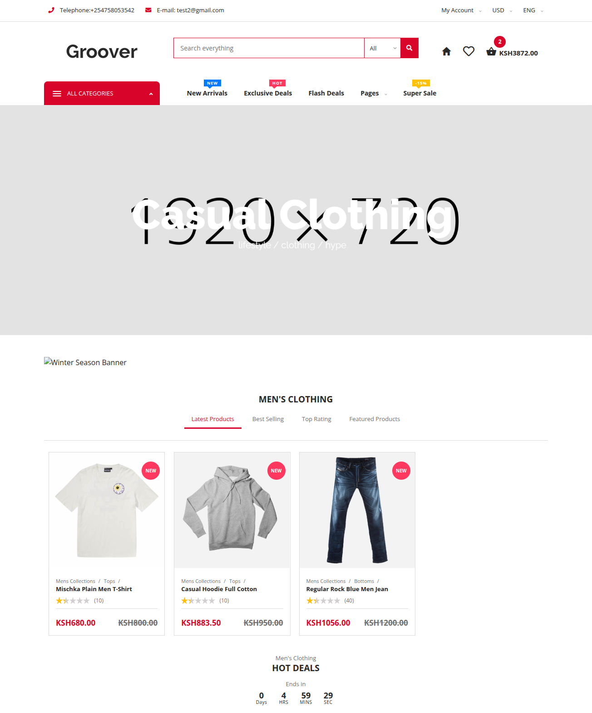
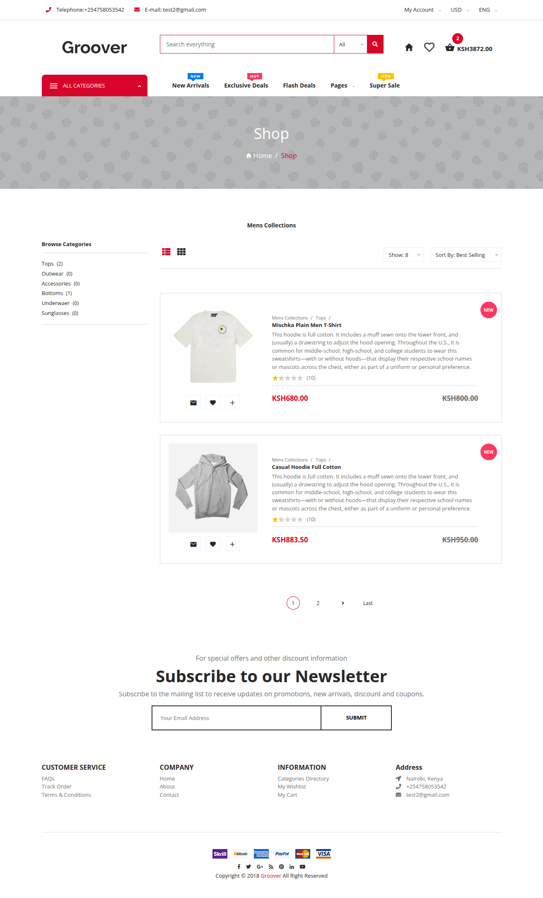
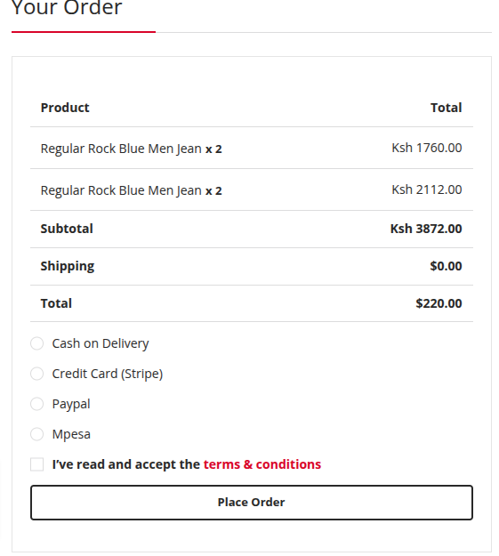
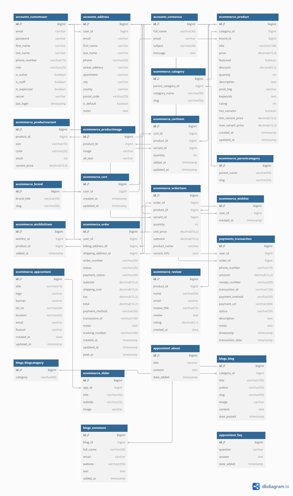
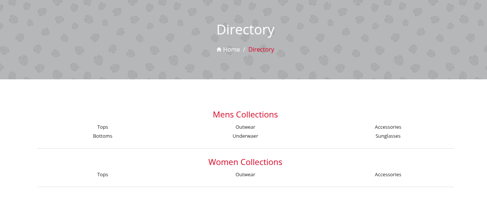
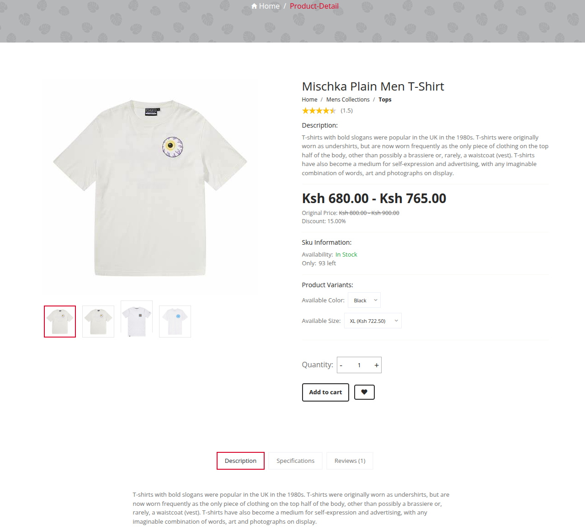
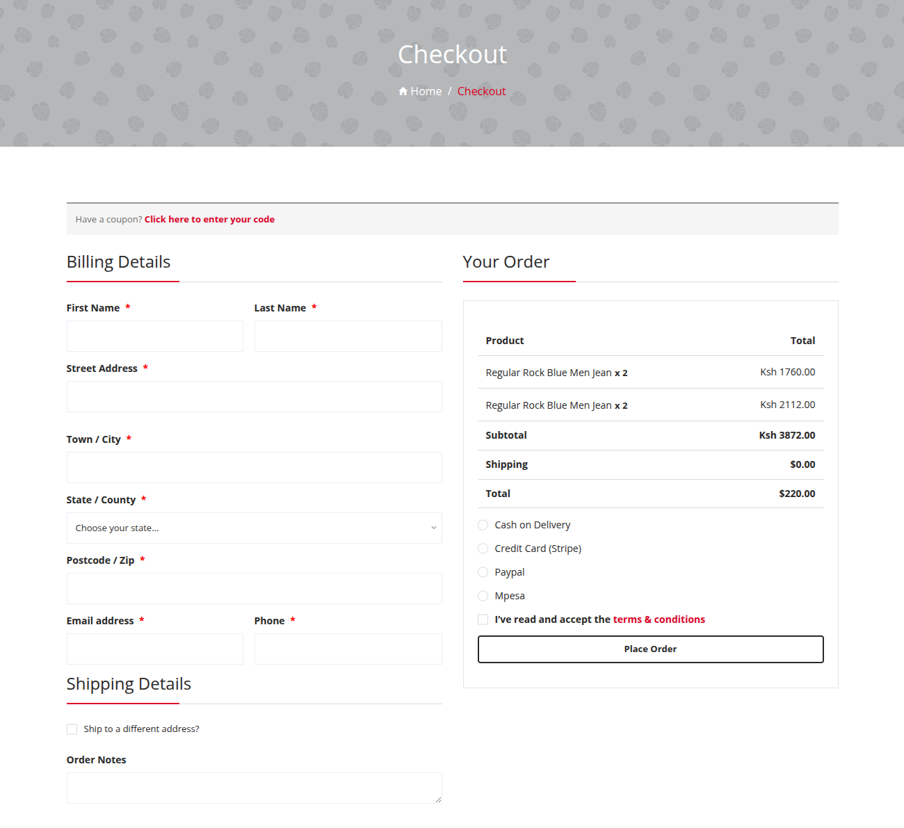

# Django E-commerce Platform 🛍️

A fully-featured e-commerce platform built with Django, featuring PayPal, M-PESA, 
and Pay on Delivery payment options. The platform includes product variants, dynamic pricing, and a robust shopping cart system.



[](https://github.com/yourusername/django-ecommerce/stargazers)
[](https://github.com/yourusername/django-ecommerce/network/members)
[](https://github.com/yourusername)

## ✨ Features

### Products & Catalog

- Product variants (size, color, etc.)
- Dynamic pricing with discounts
- Product categories and brands
- Product image gallery
- Product search and filtering
- Featured products



### Shopping Experience

- Advanced shopping cart
- Wishlist functionality
- Product reviews and ratings
- Real-time stock tracking
- Size guide
- Related products

### Payment Integration

- PayPal Integration
- M-PESA Integration
- Pay on Delivery option
- Order tracking
- Payment status monitoring
- two-step verification



### User Features

- User authentication
- Order history
- Multiple shipping addresses
- Profile management
- Wishlist management

## 🚀 Installation

1. Clone the repository

```bash
git clone https://github.com/indieka900/dj_ecommerce.git/
cd dj_ecommerce
```

2. Create a virtual environment

```bash
python -m venv venv
source venv/bin/activate  # On Windows use: venv\Scripts\activate
```

3. Install dependencies

```bash
pip install -r requirements.txt
```

4. Set up environment variables

```bash
cp .env.example .env
# Edit .env with your configuration
```

5. Run migrations

```bash
python manage.py migrate
```

6. Create a superuser

```bash
python manage.py createsuperuser
```

7. Run the development server

```bash
python manage.py runserver
```

8. Database Setup (using PostgreSql)

```bash
DB_DATABASE="db_name"

DB_ENGINE="db_engine"

DB_USER='dbuser'

DB_PASSWORD='yourpassword'

DB_HOST='localhost'

DB_PORT=5432
```

9. Email Setup (gmail)

```bash
ACCOUNTS_EMAIL_PASSWORD = your-app-password
EMAIL_HOST_USER = your-email@gmail.com
EMAIL_PORT = 587 
EMAIL_USE_TLS = True
EMAIL_HOST = 'smtp.gmail.com' 
```

## 💳 Payment Configuration

### PayPal Setup

1. Create a PayPal Developer account
2. Get your API credentials
3. Add them to your `.env` file:

```bash
PAYPAL_ID=your_client_id
PAYPAL_SECRET=your_secret
PAYPAL_BASE_URL='https://api.sandbox.paypal.com'
PAYPAL_MODE='sandbox'
PAYPAL_RECEIVER_EMAIL = ''
```

### M-PESA Setup

1. Create a Safaricom Developer account
2. Get your API credentials
3. Add to `.env`:

``` bash
MPESA_CONSUMER_KEY=your_consumer_key
MPESA_CONSUMER_SECRET=your_consumer_secret
MPESA_SHORTCODE=your_shortcode
PASSKEY = your-passkey  
BASE_URL = 'https://sandbox.safaricom.co.ke'
```

## 🛠️ Tech Stack

- **Backend:** Django 4.2+
- **Frontend:** HTML, CSS, JavaScript
- **Database:** PostgreSQL
- **Payment:** PayPal API, M-PESA API
- **Cache:** Redis

## 📊 Database Schema



## 🤝 Contributing

Contributions are welcome! Please feel free to submit a Pull Request.

1. Fork the repository
2. Create your feature branch (`git checkout -b feature/AmazingFeature`)
3. Commit your changes (`git commit -m 'Add some AmazingFeature'`)
4. Push to the branch (`git push origin feature/AmazingFeature`)
5. Open a Pull Request

## ⭐ Support

If you like this project, please give it a ⭐️ and share it with your friends! You can also:

- [Fork this repository](https://github.com/indieka900/dj_ecommerce/fork)
- [Follow me on GitHub](https://github.com/indieka900)
- [Connect on LinkedIn](https://linkedin.com/in/joseph-indieka)

## 📸 Screenshots

### Store Page



### Product Details



### Shopping Cart


### Checkout Process



## 📄 License

This project is licensed under the MIT License - see the [LICENSE](LICENSE) file for details.

## 📞 Contact

- Website: [joseph-indieka.com](https://joseph-ke-portfolio.vercel.app/)
- Email: <indiekaj@gmail.com>
- LinkedIn: [Joseph Indieka](https://linkedin.com/in/yourusername)
- Twitter: [@Joseph_Indieka](https://twitter.com/Joseph_Indieka)

---

Made with ❤️ by [Joseph Indieka](https://github.com/indieka900)

Don't forget to ⭐ this repo and follow for more!
